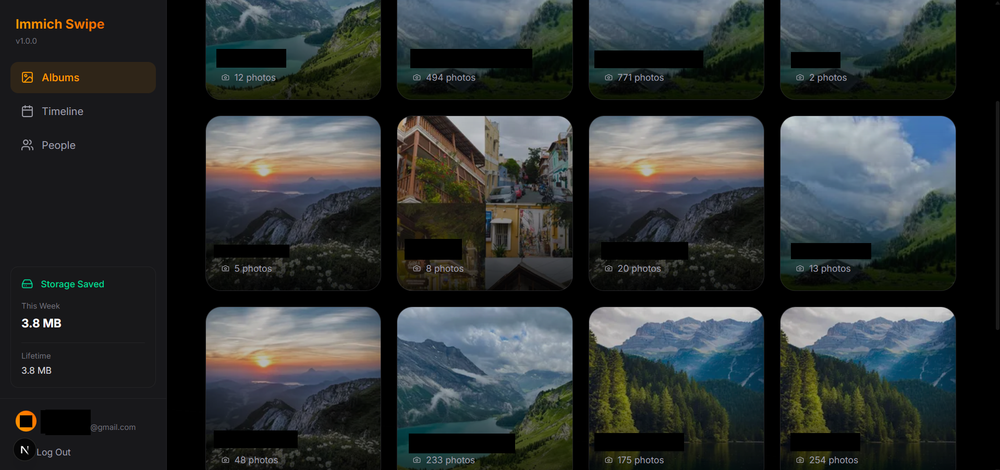
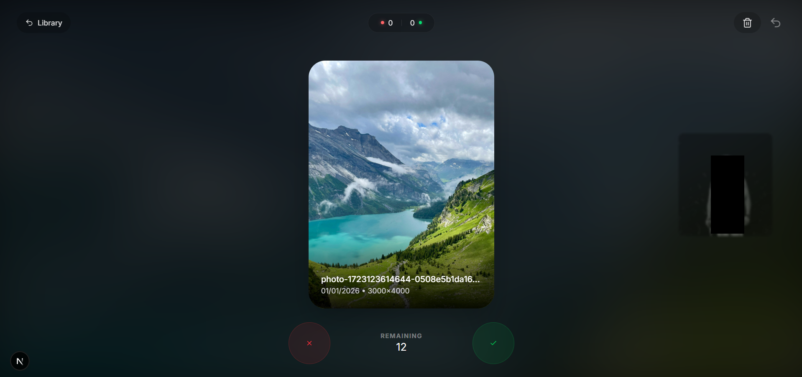
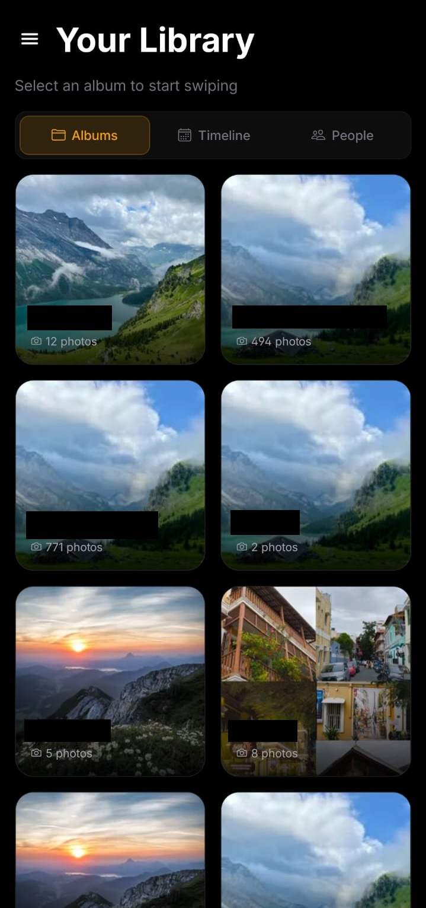
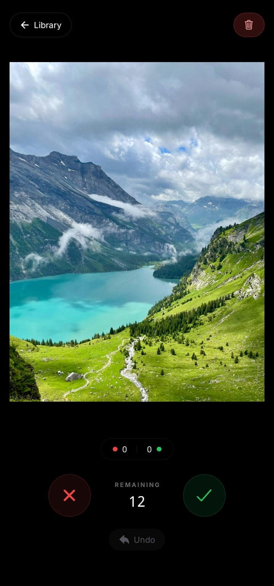
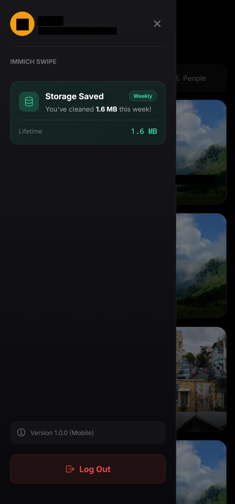

# 📸 Immich SwipeIt App

A **fast photo review app** for [Immich](https://immich.app/) – the self-hosted photo and video backup solution. Swipe right to **keep**, swipe left to **delete**. Available as both a **Web Client** and a **Mobile App**.


---

## ✨ Features

- **🎴 Tinder-style Swiping** – Intuitive swipe gestures for quick photo review  
- **↩️ Undo Support** – Made a mistake? Undo your last action instantly  
- **📁 Album Selection** – Choose which album to review from a beautiful grid  
- **🖼️ High-Quality Images** – View full-resolution photos before deciding  
- **⌨️ Keyboard Shortcuts** (Web) – Arrow keys for power users  
- **🔐 Secure Authentication** – Email/Password or Access Token login  
- **🌙 Dark Theme** – Easy on the eyes with a sleek dark interface  
- **👥 People Sorting** – Organize and review photos by specific people  
- **🗑️ Review Bin** – Double-check your deletions before they're gone  
- **💾 Storage Dashboard** – Gamify your cleaning by tracking saved space  
- **📱 Mobile Sidebar** – Clean navigation with quick access to stats  

---

## 📸 Screenshots

### Web Client
<p float="left">
  
  
</p>

### Mobile App
<p float="left">
  
  
  
</p>

---

## 📋 Prerequisites

Before you begin, ensure you have:

- ✅ A running **Immich server** (v1.91+)
- ✅ An Immich **user account** with API access
- ✅ **Node.js 18+** installed on your machine
- ✅ (Mobile only) **Expo Go** app on your device OR Android/iOS build tools

---

## 🚀 Quick Start (Web Client)

The easiest way to run the web client is using Docker. No need to clone the repo or install Node.js!

### Option A: Run directly (Recommended)

Simply run the following command in your terminal:

```bash
docker run -p 3000:3000 \
  -e NEXT_PUBLIC_IMMICH_SERVER_URL="http://YOUR_SERVER_IP:2283" \
  blackdevil0070/swipeit:latest
```

*Replace `http://YOUR_SERVER_IP:2283` with your actual Immich server URL.*

The app will be available at [http://localhost:3000](http://localhost:3000).

### Option B: Using docker-compose

Create a `docker-compose.yml` file:

```yaml
version: '3'
services:
  immich-swipe:
    image: blackdevil0070/swipeit:latest
    ports:
      - "3000:3000"
    environment:
      - NEXT_PUBLIC_IMMICH_SERVER_URL=http://YOUR_SERVER_IP:2283
```

Then run `docker-compose up -d`.

---

## 🛠️ Development & Build from Source

If you want to contribute or build the app yourself, follow these steps.

### Web Client Development

1.  **Clone the repository:**
    ```bash
    git clone https://github.com/yourusername/Immich-Swipe.git
    cd Immich-Swipe/client
    ```

2.  **Install dependencies:**
    ```bash
    npm install
    ```

3.  **Setup Environment:**
    ```bash
    cp .env.example .env.local
    # Edit .env.local with your server details
    ```

4.  **Run Locally:**
    ```bash
    npm run dev
    ```

### Building the Docker Image Manually

```bash
cd client
docker build -t swipeit-web .
docker run -p 3000:3000 -e NEXT_PUBLIC_IMMICH_SERVER_URL="..." swipeit-web
```

---

## 📱 Mobile App Setup

The mobile app is built with **Expo** (React Native) for iOS and Android.

### Installation

```bash
# 1. Navigate to the mobile directory
cd mobile

# 2. Install dependencies
npm install
```

### Running with Expo Go (Easiest)

The quickest way to test the app:

```bash
# Start the Expo development server
npm start
```

Then:
1. Install **Expo Go** on your phone ([iOS](https://apps.apple.com/app/expo-go/id982107779) | [Android](https://play.google.com/store/apps/details?id=host.exp.exponent))
2. Scan the QR code shown in your terminal
3. The app will load on your device!

> **⚠️ Note:** Your phone and computer must be on the **same network**

### Building a Standalone APK/IPA

For a production build:

```bash
# Android APK
npx expo run:android

# iOS (requires macOS and Xcode)
npx expo run:ios
```

Or use EAS Build for cloud builds:

```bash
# Install EAS CLI
npm install -g eas-cli

# Build Android APK
eas build --platform android --profile preview

# Build iOS (requires Apple Developer account)
eas build --platform ios
```

### Usage

1. **Launch the app** – You'll see the login screen
2. **Enter your server URL** – e.g., `http://192.168.1.100:2283`
3. **Choose authentication method:**
   - **Email/Password** – Use your Immich login credentials
   - **Access Token** – Use an API key from Immich
4. **Select Album** – Tap on an album to start reviewing
5. **Swipe to Review:**
   - 👉 **Swipe Right** = **Keep** the photo
   - 👈 **Swipe Left** = **Delete** the photo
   - Use the bottom buttons for tap-based control
   - Tap **Undo** to reverse your last action

---

## 🔧 Configuration

### Environment Variables (Web Client)

| Variable | Required | Description |
|----------|----------|-------------|
| `NEXT_PUBLIC_IMMICH_SERVER_URL` | Yes | Your Immich server URL |
| `NEXT_PUBLIC_IMMICH_EMAIL` | No | Email for auto-login |
| `NEXT_PUBLIC_IMMICH_PASSWORD` | No | Password for auto-login |
| `NEXT_PUBLIC_IMMICH_ACCESS_TOKEN` | No | API key for auto-login |

### Finding Your Immich Server URL

- **Local network:** `http://YOUR_PC_IP:2283` (e.g., `http://192.168.1.50:2283`)
- **Remote:** Your domain with HTTPS (e.g., `https://photos.yourdomain.com`)

To find your local IP:
- **Windows:** Run `ipconfig` in Command Prompt
- **macOS/Linux:** Run `ifconfig` or `ip a` in Terminal

---

## 🎮 Controls Reference

### Web (Desktop)

| Action | Gesture | Keyboard |
|--------|---------|----------|
| Keep | Swipe Right | `→` Arrow Key |
| Delete | Swipe Left | `←` Arrow Key |
| Undo | Click Undo button | – |
| Back to Albums | Click Library | `Escape` |

### Mobile

| Action | Gesture | Button |
|--------|---------|--------|
| Keep | Swipe Right | ✅ Green Button |
| Delete | Swipe Left | ❌ Red Button |
| Undo | – | ↩️ Undo Button |
| Back to Albums | Tap Library chip | – |

---

## 📁 Project Structure

```
Immich-Swipe/
├── client/                 # Next.js web client
│   ├── src/
│   │   ├── app/           # Pages (Next.js App Router)
│   │   ├── components/    # React components
│   │   ├── context/       # Auth & Swipe contexts
│   │   └── types/         # TypeScript types
│   └── package.json
│
└── mobile/                 # Expo React Native app
    ├── app/               # Screens (Expo Router)
    ├── components/        # React Native components
    ├── context/           # Auth & Swipe contexts
    ├── lib/               # API utilities
    └── package.json
```

---

## ⚠️ Important Notes

1. **Soft Delete** – Deleted photos are moved to Immich's trash, not permanently deleted. You have 30 days to recover them in Immich.

2. **Network Access** – The mobile app needs network access to your Immich server. For local servers, ensure your firewall allows connections on port 2283.

3. **HTTPS Requirement** – If accessing over the internet, use HTTPS with a valid SSL certificate for security.

4. **HEIC/HEIF Support** – HEIC images are automatically converted to JPEG thumbnails for compatibility.

---

## 🐛 Troubleshooting

### "Failed to connect" Error
- Verify your server URL is correct and accessible
- Ensure you're on the same network as your Immich server
- Check that port 2283 is open in your firewall

### Images Not Loading
- Confirm your access token/credentials are valid
- Check Immich server logs for errors
- Try refreshing the page or restarting the app

### Mobile App Not Connecting
- Use your computer's **local IP** (not `localhost`)
- Ensure both devices are on the **same Wi-Fi network**
- Disable VPN if enabled

---

## 📝 License

This project is open source and available under the [MIT License](LICENSE).

---

## 🙏 Acknowledgments

- [Immich](https://immich.app/) – The amazing self-hosted photo solution
- [Expo](https://expo.dev/) – For making React Native development a breeze
- [Next.js](https://nextjs.org/) – The React framework for production

---

**Made with ❤️ for photo enthusiasts who value their privacy**
